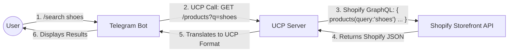

# How Shopify Info is Relayed to UCP (and Telegram)

You asked: **"Should I go for the public API?"**

**The Answer:**
**YES.** unique identifiers for products and easier checkout flows make the **Shopify Storefront API (Public API)** the best choice for a Telegram Bot that acts like a customer.

## The Architecture: How it Relays

Your UCP Server acts as a **Translator (Adapter)**. It sits between Telegram and Shopify.



## Why Storefront API?
1.  **Public Access**: You don't need full Admin rights, just a "Storefront Access Token".
2.  **Customer Focused**: It has built-in mutations for `checkoutCreate`, `cartCreate` which match exactly what a bot needs to do.

## How we implement the "Relay"

We will modify the UCP Server to stop looking at the local database and start talking to Shopify.

**Step 1: The Adapter (`shopify_client.py`)**
We write a simple client that sends GraphQL queries to Shopify.

**Step 2: The Translation (`products.py`)**
We update the product route to use this client.

```python
# Conceptual Code
async def search_products(q):
    # 1. Get from Shopify
    shopify_json = await shopify_client.query_products(q)
    
    # 2. Relay (Translate) to UCP
    ucp_items = []
    for p in shopify_json['products']['edges']:
        item = {
            "id": p['node']['id'],        # Shopify ID
            "name": p['node']['title'],   # Shopify Title
            "price": p['node']['priceRange']['minVariantPrice']['amount']
        }
        ucp_items.append(item)
        
    return {"items": ucp_items}
```

I will now create this `shopify_client.py` for you, so we can connect your real store (or a demo store) whenever you are ready.
